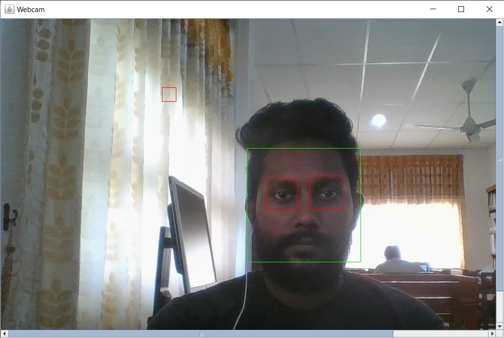

# Simple face and eye detection
 OpenCV basic face detection and eye detection using the Haar Feature-based Cascade Classifiers.

OpenCV provides pretrained models, that can be read using the .xml file loading method. 
The pretrained models are located in the data folder in the OpenCV installation.
I used the following XML files to detect face and eyes, which returns boundary rectangles for the detected faces or eyes.

•	haarcascade_frontalface_alt.xml
•	haarcascade_eye.xml

